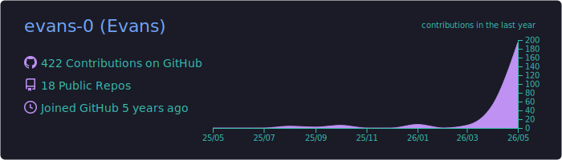
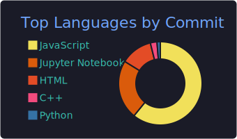

---

✨ *A long time ago, in a galaxy far, far away...* ✨

*...a data analyst rose from the Outer Rim to bring balance to Finance and the Force.*

---

### 🌌 Jedi Holocron

*Transmitted from the Rebel Alliance Data Archives - classified intelligence dossier on Agent Evans Devakrubakar.*

I'm a **Jedi Data Analyst** with the Alliance - using quant models and data science to outsmart Imperial markets one trade at a time.

- 🔭 Currently mastering **Reservoir Computing** to predict chaos across the Outer Rim
- 📊 Running **Monte Carlo** simulations to keep Alliance portfolios sharp
- 💹 Passionate about **quantitative finance** - what keeps the Rebellion funded
- 🎓 **M.Sc. Data Analytics** | **BIDA®** certified Jedi Knight

 

---

### ⚔️ Arsenal & Equipment

**Languages of the Force**

**Alliance Command Systems**

**Intelligence & Reconnaissance**

---

### 🚀 Active Missions

<table>
<tr>
<td width="50%">

#### 🌀 Operation: NGRC - Chaos Oracle
Building physics-aware **NGRC** models to map the basins of chaotic systems - including the **Nordmark Map** - so the Alliance can see the chaos coming.

</td>
<td width="50%">

#### 🔁 Operation: Echo Chamber
Using reservoir computing to **predict the dynamics** of chaotic systems with Jedi-level precision - always one hyperspace jump ahead of Imperial disruption.

</td>
</tr>
<tr>
<td width="50%">

#### 📈 [Operation: Sharpe's Edge](https://github.com/evans-0/Portfolio_Optimization)
Python-powered **Monte Carlo** simulation tool maximizing Sharpe Ratios for Indian stocks - fueling the Rebellion, one optimized portfolio at a time.

</td>
<td width="50%">

#### 📊 [Galactic Intelligence Reports](https://public.tableau.com/app/profile/evans.d4005/viz/CalwestRegionalPerformance_17682086275790/Dashboard2)
E-commerce and financial data from across the galaxy, turned into **KPI dashboards** for Alliance command.

</td>
</tr>
</table>

---

### 📡 Alliance Battle Records

---

### 🐍 Starfield Patrol Log

---

### 📻 Open a Comms Channel

*Transmit on any of the following Alliance frequencies - the Council is listening.*

---

⭐ *May the Force - and clean code - be with you, always.* ⭐

