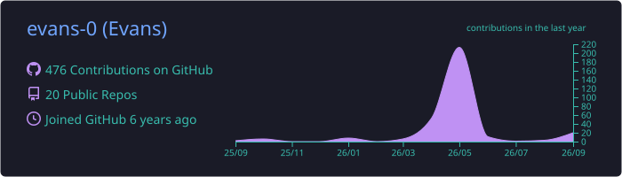
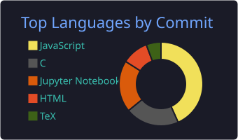

 

---

### 👨‍💻 Executive Summary

I am a data-driven professional bridging the gap between **Quantitative Finance** and **Data Science**. Currently pursuing an M.Sc. in Data Analytics & Computational Sciences at Digital University Kerala, I specialize in building robust quantitative models, engineering scalable database architectures, and designing interactive financial dashboards.

- 🔭 **Current Focus:** Architecting an IoT data dashboard by migrating legacy architecture from Google Sheets to PostgreSQL to handle real-time sensor streams and ensure system scalability.
- 📈 **Quantitative Research:** Developing predictive financial models and alphas utilizing complex data structures to analyze market behaviors and optimize risk metrics.
- 📫 **Let's Collaborate:** Always open to discussing FinTech innovations, algorithmic trading, quantitative modeling, and data-centric solutions.

---

### 💼 Professional Experience

| Role & Organization | Key Contributions |
| :--- | :--- |
| **Research Consultant**   *WorldQuant Brain (Freelance, Remote)* | <ul><li>Conducting quantitative research and developing predictive financial models/alphas utilizing advanced data structures.</li><li>Applying principles of quantitative finance to analyze market behaviors and optimize risk metrics.</li></ul> |
| **Research And Development Intern**   *Digital University Kerala* | <ul><li>Engineering an IoT data dashboard, migrating legacy architecture from Google Sheets to a robust PostgreSQL database.</li><li>Designing optimized database schemas to handle real-time IoT sensor streams and building dynamic visualization pipelines.</li></ul> |

---

### 🛠️ Technical Arsenal

| Domain | Technologies |
| :--- | :--- |
| **Languages** | Python, R, C/C++, SQL (MySQL, PostgreSQL), HTML |
| **Data Science & ML** | Pandas, NumPy, Matplotlib |
| **Data Visualization & BI** | Tableau, Power BI, IBM Cognos Analytics, BigQuery |
| **Tools & Platforms** | Git, GitHub, Linux, LaTeX, Google Cloud Platform |

---

### 📂 Featured Projects

| Project | Description | Core Stack |
| :--- | :--- | :--- |
| **Indian Stock Market Portfolio Optimization** | Python-based optimization model calculating the efficient frontier for Indian stocks. Implemented Sharpe Ratio maximization logic to identify optimal asset allocation and reduce portfolio risk. | `Python` `Pandas` `NumPy` |
| **Financial Performance Dashboard** | Interactive dashboard visualizing KPIs like Gross Revenue, Profit, Discount, and Profit Margin with dynamic filtering for regional performance analysis. | `Tableau` `Data Modeling` |

---

### 📜 Certifications & Achievements

- **Certifications:** Google Cloud Career Launchpad: Data Analytics, CFI Business Intelligence & Data Analyst (BIDA), Duke University Behavioral Finance, IBM SQL, ETL and BI Fundamentals.
- **Achievements:** Winner of 3+ intercollegiate physics quizzes (1st place), including Madame Marie Curie Trophy (2024) and Battle of Brainiez (2024).

---

### 📊 GitHub Analytics

  

 

**Contribution History**
 

